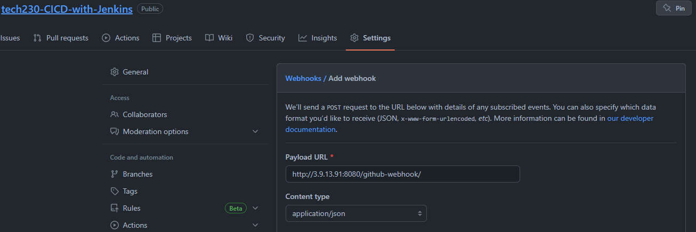

## **Jenkins and its stages**

Jenkins is an open source continuous integration/continuous delivery and deployment (CI/CD) automation software DevOps tool; It is used to implement CI/CD workflows, called pipelines.

As well as Jenkins, there are also other automation servers such as Bamboo and TeamCity. These automation servers all share similar capabilities however Jenkins’ highlights are its community and many plugins whilst Bamboo and TeamCity focus on product integrations such as Jira and IntelliJ.

A stage (or stage block) is a specific part of a task performed through the pipeline; for example, build, test, deploy.


## **Jenkins process flows**

The Jenkins process initally begins with all team members pushing tested code to a single repository; Continuous Integration is the practice of automating the integration of code continuously from all team members.

Jenkins can be set up to automatically test code and transport it to the master node, if all test cases past; or else, they are given to the agent node for feedback and review to the relevant team members.

When tested code is ready, it can be deployed at any point through manual releases; this is defined as Continuous Delivery. This step can also be automated to enable Continuous Deployment.


## **Accessing a Jenkins server and checking its OS**

1. Navigate to a Jenkins server, typically available on port `8080` and login in with the suitable credentials.


2. Click on the `New Item` tab on the left panel and Create `Freestyle project`.


3. Firstly, discard old builds and keep a maximum of 3 builds then navigate to the Build section and select "execute shell". Check the os using command "uname -a".


4. Navigate to the "build history".


5. Read the Console Output under the drop down menu to show the OS and its version.


## **Testing an application using Jenkins**

1. Follow steps 1 - 3 as shown above and have a GitHub repository ready with the application stored.

2. Add a GitHub project using the HTTPS URL from the repository.


3. Select the `Restrict where this project can be run` option to restrict the build when not in use. A label expression has already been provided, enter one as required.

> Note: This example build is only used to test the application.


4. Add the version control system using the github repository's SSH URL and credentials; Use the SSH username with private key option.


5. Tick the `GitHub hook trigger for GITScm polling` option to trigger a build any time a change is made in the GitHub repository; the repository is also shown within the Jenkins `workspace` for the particular item.


6. `Provide Node & npm bin/ folder to PATH` to attach the required dependencies and environment variable.


7. Execute a script on build to navigate to the correct file path to install npm and its testing module.


8. The `Console Output` should then display the following with all tests passed.


## **Configure the webhook integration between Jenkins and GitHub**

1. Navigate to `settings` and `webhooks` within the GitHub repository and `add webhook`.

2. Enter the payload URL in the format `http://<public-ipv4-address>:8080/github-webhook/` and select the content type as `application/json`.



3. No secret is required, select `just the push event` and `active` then proceed to `add webhook`


4. The build history should then update and trigger a test.


## **Creating an automated Jenkins CI merge item**

This section ties in a new branch `dev` to be merge to the `main` branch, when a new push is initiated.

1. First, create a new branch in the git repository and call it `dev`.

```bash
git branch dev # Create a branch without moving to it.

git checkout dev # Move to the branch.
```

> Note: the new branch may need to be initialised through pushing it to the github repo.

2. Create a new item in Jenkins called `name-ci-merge`.

3. Configure your same GitHub repository firstly with HTTPS then with SSH for Source Code Management.

4. Specify the branch as the new branch `*/dev` and add the plugin (or behaviour) `Merge before build`, save the item; ensure that you are merging the branch to main as shown below.


5. Return to the original CI item and change the branch specifier to `*/dev` as well.


6. Add the CI merge item to the post-build actions if the tests pass to automate the trigger.

