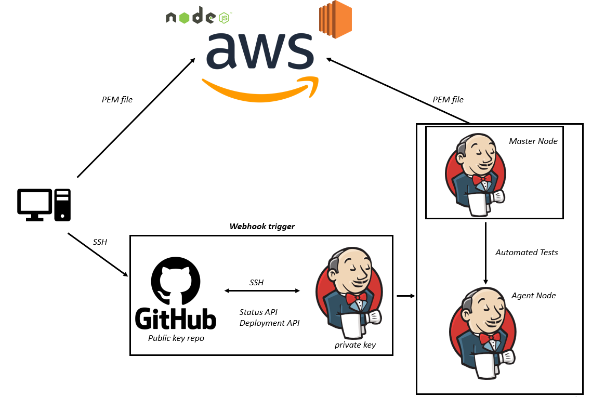

## Jenkins and its stages

Jenkins is an open source continuous integration/continuous delivery and deployment (CI/CD) automation software DevOps tool; It is used to implement CI/CD workflows, called pipelines.

As well as Jenkins, there are also other automation servers such as Bamboo and TeamCity. These automation servers all share similar capabilities however Jenkins’ highlights are its community and many plugins whilst Bamboo and TeamCity focus on product integrations such as Jira and IntelliJ.

A stage (or stage block) is a specific part of a task performed through the pipeline; for example, build, test, deploy.

## Jenkins Process Flow

## Accessing a Jenkins server and checking its OS

1. Navigate to a Jenkins server, typically available on port `8080` and login in with the suitable credentials.

2. Click on the `New Item` tab on the left panel and Create `Freestyle project`.

3. Navigate to the Build section and select "execute shell". Check the os using command "uname -a".

4. Navigate to the "build history".

5. Read the Console Output under the drop down menu to show the OS and its version.

